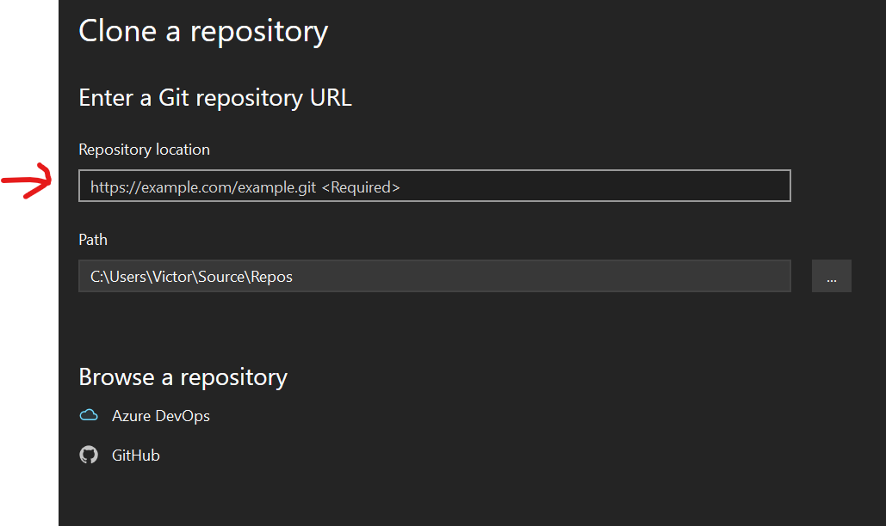
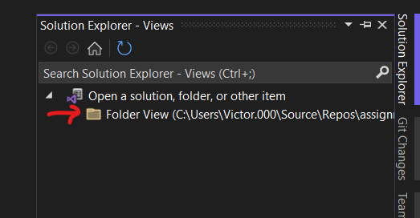
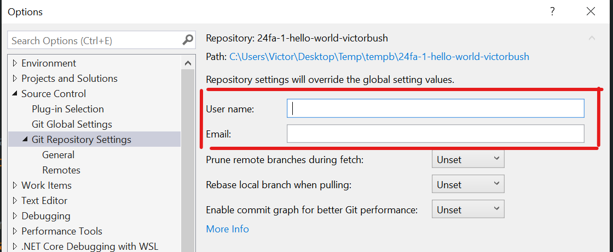
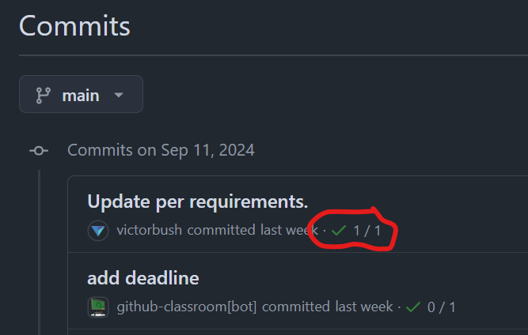

# Using Visual Studio 2022 on Windows

## Install Visual Studio 2022 Community

Download and install the _community_ edition of Visual Studio 2022 [here](https://visualstudio.microsoft.com/vs/community/). The community edition is free.

In the Visual Studio Installer, make sure you check the **Desktop development with C++** workload. If you've previously installed Visual Studio but did not check this box, you can reopen the Visual Studio Installer and modify the existing installation to include this workload.

## Clone repository

_Note: Part of the instructions below were copied from Microsoft's [documentation](https://learn.microsoft.com/en-us/visualstudio/version-control/git-clone-repository?view=vs-2022)._

Open Visual Studio 2022.

From the startup screen, click **Clone a repository**.

If the startup screen is not visible, you can use the **Git** menu at the top of the main Visual Studio window to clone a repository.

In the **Clone a repository** window click the **GitHub** option.

Use the **Sign in** dropdown menu to sign in to GitHub.

You may need to authorize Visual Studio with your GitHub account.

Proceed to authorize your account. Once you are successfully signed in, you should return to the **Open from GitHub** window within Visual Studio. Select your assignment repository from the list or enter the repository URL manually. Your repository will be named someting like `eu-cpsc111/24fa-1-hello-world-your-name`.

You can select where you want to clone the repository to on your local computer or use the default path. When you are ready, click the **Clone** button.

If this window does allow you to clone any repositories, go back to your repository in GitHub and copy the repository URL:

Go back to Visual Studio and paste the repository URL in the **Clone a repository** window (close the **Open from GitHub** window first):

Once the repository is cloned, open the **Solution Explorer** and double-click the **Folder View** item in the list.

After the folder loads in Visual Studio, the **Solution Explorer** will show a list of files within the repository on your local PC.

## Fix Git identity

In Visual Studio, open **Git** -> **Settings** from the top menu.

Go to **Source Control** -> **Git Repository Settings** -> **General**. Update the **User name** and **Email** fields to match your GitHub account.

Save the changes and restart Visual Studio.

## Build and run

In the **Solution Explorer**, double click the `main.cpp` file to open it.

Click the green play button in the toolbar to build and run the program.

If the button does not say `hello-world`, click the arrow on the right side of the button and select it from the list.

## Pushing Changes to GitHub

After you make changes to files in your local repository, you can create a commit using the **Git Changes** panel in Visual Studio.

Enter a commit message in the text box and click the **Commit All** button.

This creates a commit in your local repository. You must push those changes to GitHub. Click the **Sync** button to do this.

You can confirm your commits have been properly pushed to GitHub by viewing the **Commits** list in your GitHub repository.

Your latest commit should appear in the list. The commit should also show a green check mark to indicate that the automated tests have passed.

If the commit has a red "X" instead of green checkmark, then the automated tests did not pass. You can click on the status symbol to get more details and view the results of the automated tests.
